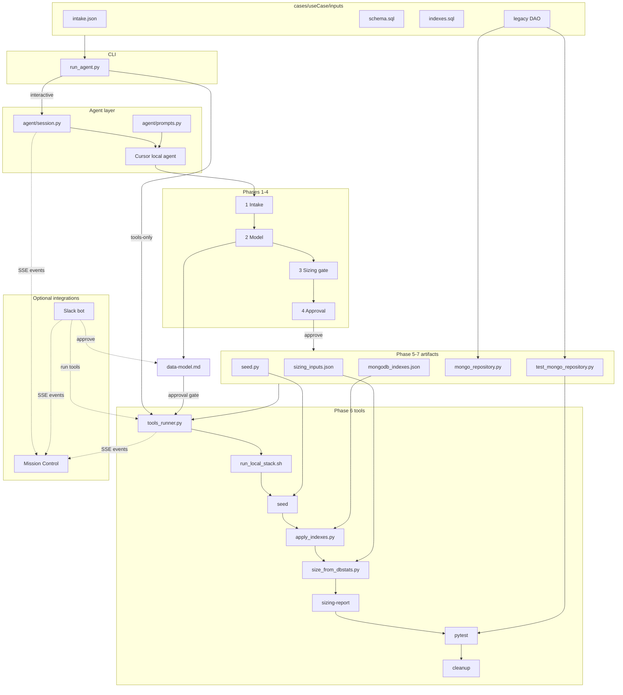
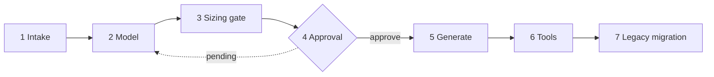

# MongoDB Sizing Agent

Standalone Python project that uses the **Cursor SDK** (local agent) for relational → MongoDB document modeling, plus deterministic scripts for Docker seed/load, indexes, and Atlas-oriented sizing from `dbStats` / `collStats`.

Optional demo integrations (both fail-safe when not running):

- **[Mission Control dashboard](#demo-dashboard-mission-control)** — local web UI with live phase rail, activity feed, and artifact previews
- **[Slack approval bot](#slack-approval-async-beat)** — Socket Mode bot for async data-model approval and sizing summaries

## Architecture

The project splits **agent-driven modeling** (interactive, LLM) from **deterministic tooling** (scripts, Docker, formulas). The agent writes artifacts under `cases/{useCase}/`; the tools pipeline reads those artifacts and produces sizing numbers. Atlas Disk/RAM figures come **only** from `scripts/size_from_dbstats.py`—never from agent prose.



### Component map

| Path | Role |
|------|------|
| `run_agent.py` | CLI entry: interactive agent loop or `--phase tools-only` |
| `agent/session.py` | Cursor SDK lifecycle, session persistence, approval parsing |
| `agent/prompts.py` | System prompt and per-case kickoff message |
| `agent/tools_runner.py` | Subprocess orchestration for Docker → seed → indexes → sizing → optional repository pytest |
| `dashboard/server.py` | Mission control web UI: SSE events, phase state, artifact previews |
| `slack_app/bot.py` | Slack Socket Mode bot: watches all `cases/` (or `--case`), approval + sizing posts |
| `scripts/sizing_inputs.py` | JSON Schema validation, embedded cardinality derivation |
| `scripts/size_from_dbstats.py` | dbStats/collStats → Atlas Disk/RAM formulas |
| `scripts/apply_indexes.py` | Apply `mongodb_indexes.json` via PyMongo |
| `scripts/index_utils.py` | Redundant compound-prefix index checks |
| `scripts/report_render.py` | Markdown report from sizing JSON |
| `templates/` | JSON schemas and artifact templates |
| `cases/{useCase}/` | Per-workload inputs and generated outputs |
| `AGENTS.md` | Agent workflow gates and conventions |

## Prerequisites

- Python 3.10+
- [Colima](https://github.com/abiosoft/colima) on macOS (or any Docker runtime): `colima start`, then `docker ps`
- `CURSOR_API_KEY` for interactive agent runs ([Cursor dashboard → Integrations](https://cursor.com/dashboard/integrations))

### Environment variables

| Variable | Required | Purpose |
|----------|----------|---------|
| `CURSOR_API_KEY` | Interactive mode | Cursor SDK local agent auth |
| `MONGODB_URI` | Tools pipeline | Local MongoDB URI (default: `mongodb://localhost:27017`) |
| `DASHBOARD_URL` | Optional | Event POST target for Mission Control (default: `http://localhost:8765/events`) |
| `SLACK_BOT_TOKEN` | Slack bot | Bot User OAuth Token (`xoxb-…`) |
| `SLACK_APP_TOKEN` | Slack bot | App-Level Token with `connections:write` (`xapp-…`) |
| `SLACK_CHANNEL_ID` | Slack bot | Channel ID where approval requests are posted |

Copy `.env.example` to `.env` and fill in values. Tools-only runs do not need `CURSOR_API_KEY`. Dashboard and Slack vars are only needed when running those integrations.

## Setup

```bash
cd mongodb-sizing-agent
python -m venv .venv
source .venv/bin/activate
pip install -r requirements.txt
cp .env.example .env   # add CURSOR_API_KEY
chmod +x scripts/run_local_stack.sh
```

## Case layout

Each workload lives under `cases/{useCase}/`:

```
cases/{useCase}/
├── inputs/
│   ├── intake.json          # customer: metadata, productionRowCounts, dataModelingNotes
│   ├── schema.sql           # relational DDL (required)
│   ├── indexes.sql          # relational indexes (optional)
│   └── legacy/              # optional legacy JDBC DAO for Phase 7 migration
│       └── ClaimDocumentRepository.java
└── outputs/
    ├── data-model.md        # disposition, mapping, approval status
    ├── sizing_inputs.json   # agent-generated: collection counts, embedded cardinality
    ├── session.json         # persisted agent_id for --resume
    ├── seed.py              # generated post-approval
    ├── mongodb_indexes.json # generated post-approval
    ├── mongo_repository.py  # Phase 7: PyMongo repository (when legacy DAO present)
    ├── test_mongo_repository.py  # Phase 7: integration tests against seeded Mongo
    ├── sizing-report.json   # from tools pipeline
    └── sizing-report.md     # rendered report
```

Local MongoDB databases are named `sizing_{slugified_use_case}` (e.g. `sizing_claims_document_history`).

## Demo dashboard (Mission Control)

A local web UI shows the agent working through gated phases in real time: phase rail, tool-call feed, artifact checklist, and Atlas sizing results. The CLI emits events to the dashboard; if the dashboard is not running, the agent is unaffected.

**Terminal 1** — start the dashboard:

```bash
python -m dashboard.server --case _example --port 8765
```

Open [http://localhost:8765](http://localhost:8765) (or `?case=claim_history` in the URL).

**Terminal 2** — run the agent or tools pipeline as usual:

```bash
python run_agent.py --case _example
# or after approval:
python run_agent.py --case _example --phase tools-only --no-cleanup
```

Optional: set `DASHBOARD_URL` if the server is not on `http://localhost:8765/events`.

## Slack approval (async beat)

A Slack bot (Socket Mode — no public URL) posts the data-model approval request with **Approve** / **Request changes** buttons, flips `data-model.md` on approve, notifies Mission Control, and posts the Atlas sizing summary when tools finish.

**Setup (one time):**

1. Create a Slack app at [api.slack.com/apps](https://api.slack.com/apps) using [`slack_app/manifest.yaml`](slack_app/manifest.yaml) (enable Socket Mode, install to workspace).
2. Copy **Bot User OAuth Token** → `SLACK_BOT_TOKEN`, **App-Level Token** (`connections:write`) → `SLACK_APP_TOKEN`.
3. Invite the bot to a channel; copy channel ID → `SLACK_CHANNEL_ID` (right-click channel → View channel details).

**Demo terminals:**

```bash
# Terminal 1 — dashboard
python -m dashboard.server --case settlement

# Terminal 2 — Slack bot (watches all cases/ by default)
bash scripts/run_slack_bot.sh
# or: .venv/bin/python -m slack_app.bot

# Terminal 3 — agent (any case)
python run_agent.py --case settlement
```

The bot polls every case folder under `cases/` and posts when **any** workload gets a new pending `data-model.md`. Pass `--case NAME` to watch a single case only. Approve buttons embed the case name, so multi-case watching works without restarting the bot.

When the agent writes `data-model.md` with status **pending**, the bot posts the approval request. Tap **Approve** in Slack — the file flips to **approved**, the dashboard badge updates, and the REPL picks up agent mode on the next message. If generate artifacts are missing, the bot resumes the case Cursor agent (`outputs/session.json`) in agent mode to write them; if they already exist (or after generation finishes), it runs the tools pipeline and posts Disk/RAM in thread.

## Workflow


1. Create `cases/{useCase}/inputs/` with `intake.json` (include `productionRowCounts` and `dataModelingNotes` when known), `schema.sql`, optional `indexes.sql`, and optional `legacy/ClaimDocumentRepository.java` for repository migration.
2. Run the agent:

```bash
python run_agent.py --case claim_history
```

3. Work through intake and modeling. Agent writes `outputs/sizing_inputs.json` during the sizing gate from intake row counts and the proposed model.
4. When `data-model.md` is ready, reply **`approve`** (switches SDK to agent mode for implementation).
5. After approval, generate `seed.py`, `mongodb_indexes.json`, and (when legacy DAO is present) `mongo_repository.py` + `test_mongo_repository.py`, then run tools:

```bash
python run_agent.py --case _example --phase tools-only --no-cleanup
```

Or from an approved interactive session: type **`run tools`**, **`tools`**, or **`approve`** again.

### Phase gates (see `AGENTS.md`)

| Phase | Gate |
|-------|------|
| Intake | Provide relational `productionRowCounts` and `dataModelingNotes` in intake when known; ask when embed vs reference is unclear |
| Model | Write `data-model.md` with disposition, rationale, assumptions; status **pending** |
| Sizing gate | Agent writes `outputs/sizing_inputs.json`: `productionDocumentCount` per top-level collection; `avgCardinality` for embedded |
| Approval | Do **not** write `seed.py`, start Docker, or run sizing until status is **approved** |
| Generate | 500 docs per top-level collection; compound indexes only (no redundant prefixes); optional legacy → PyMongo repository |
| Tools | `verify_approved()` blocks pipeline if `data-model.md` is not approved; runs repository pytest when `test_mongo_repository.py` exists |

Resume a prior session:

```bash
python run_agent.py --case claim_history --resume <agent_id>
# or rely on outputs/session.json when agent_id is saved
```

## CLI reference

| Flag | Purpose |
|------|---------|
| `--case NAME` | Case folder under `cases/` (required) |
| `--resume ID` | Resume Cursor agent by ID |
| `--phase interactive` | Default: REPL loop with Cursor SDK |
| `--phase tools-only` | Skip agent; run Docker → seed → indexes → sizing → optional repository pytest |
| `--cleanup` | Drop case DB immediately after sizing (tools-only) |
| `--no-cleanup` | Skip post-sizing cleanup prompt (tools-only) |

### Dashboard and Slack CLIs

| Command | Purpose |
|---------|---------|
| `python -m dashboard.server --case NAME [--port 8765]` | Mission Control web UI (SSE events, phase state, artifact API) |
| `python -m slack_app.bot [--case NAME] [--channel ID]` | Slack Socket Mode bot; watches `cases/` for pending approvals |

## Artifacts

| File | Phase |
|------|-------|
| `outputs/data-model.md` | 2 — model + approval |
| `outputs/sizing_inputs.json` | 3 — agent-derived sizing metadata |
| `outputs/seed.py`, `mongodb_indexes.json` | 5 |
| `outputs/mongo_repository.py`, `test_mongo_repository.py` | 7 — legacy JDBC → PyMongo (when `inputs/legacy/*` present) |
| `outputs/sizing-report.md`, `.json` | 6 |

## Sizing script (standalone)

```bash
python scripts/size_from_dbstats.py \
  --uri mongodb://localhost:27017 \
  --db sizing_claims_document_history \
  --production-count 20000000 \
  --sizing-inputs-file cases/_example/outputs/sizing_inputs.json \
  --out cases/_example/outputs/sizing-report.json
```

Database-level Disk/RAM uses **dbStats** scaling only. Per-collection **collStats** rows appear in the report for detail but are not summed into Atlas totals.

## Tests

Unit tests validate schemas, sizing formulas, index rules, session/CLI wiring, and example-case contracts. Integration tests start Mongo via `run_local_stack.sh` and run the full tools pipeline. Agent tests require a live `CURSOR_API_KEY`.

```bash
# Fast: unit + wiring (no Docker, no Cursor API)
pytest -m "not integration and not agent"

# Self-contained E2E (Docker required; starts stack in session fixture)
pytest -m integration

# Live agent smoke (manual / pre-demo)
pytest -m agent

# Full suite
pytest
```

### Test files

| File | Tier | Coverage |
|------|------|----------|
| `test_intake_schema.py` | Unit | `intake.json` JSON Schema validation |
| `test_sizing_inputs_schema.py` | Unit | `sizing_inputs.json` validation, cardinality derivation |
| `test_sizing_inputs_helpers.py` | Unit | `database_production_document_count`, load |
| `test_sizing_formulas.py` | Unit | dbStats/collStats scaling and report assembly |
| `test_report_render.py` | Unit | Markdown report sections |
| `test_report_render_extended.py` | Unit | Warnings and empty collections in reports |
| `test_mongodb_indexes_schema.py` | Unit | Redundant compound-prefix index detection |
| `test_seed_contract.py` | Unit | Example `seed.py` constants (500 docs, `RANDOM_SEED`) |
| `test_approval_gate.py` | Unit | Example `data-model.md` parses as approved |
| `test_session.py` | Unit | Approval parsing, session I/O, API key, local options |
| `test_prompts.py` | Unit | `initial_case_message`, system prompt, legacy inputs |
| `test_repo_contract.py` | Unit | Example `mongo_repository.py` method parity and docstrings |
| `test_tools_runner_unit.py` | Unit | `verify_approved` gate, optional repository pytest step |
| `test_events_unit.py` | Unit | Dashboard `emit_event` fail-safe behavior |
| `test_dashboard_state.py` | Unit | Phase derivation and dashboard API |
| `test_approval_write.py` | Unit | `approve_data_model()` file writer |
| `test_slack_blocks.py` | Unit | Slack Block Kit builders |
| `test_slack_bot.py` | Unit | Multi-case discovery and watcher polling |
| `test_clear_local_mongo_unit.py` | Unit | `slugify_use_case` |
| `test_sql_index_parser.py` | Unit | SQL `CREATE INDEX` parsing |
| `test_apply_indexes_unit.py` | Unit | `keys_to_pymongo` |
| `test_session_wiring.py` | Wiring | Mocked SDK: create/resume/send/stream |
| `test_run_agent_cli.py` | Wiring | CLI routing, tools-only vs interactive |
| `test_e2e_tools_pipeline.py` | Integration | Full pipeline → sizing report |
| `test_e2e_seed.py` | Integration | 500 docs/collection, dbStats, embedded arrays |
| `test_e2e_indexes.py` | Integration | Indexes applied in MongoDB |
| `test_e2e_cli.py` | Integration | `run_agent.py --phase tools-only`, approval block |
| `test_e2e_approval_gate.py` | Integration | `run_tools_pipeline` rejects pending model |
| `test_e2e_repository.py` | Integration | Legacy repository tests against seeded Mongo |
| `test_agent_smoke.py` | Agent | Live SDK create + prompt; mocked `create_agent()` helper |

### Troubleshooting

| Symptom | Fix |
|---------|-----|
| `BadRequestError: Local SDK agents require an explicit model` | Fixed in `send_and_wait` — `SendOptions` must include `model` on resume/approve sends |
| `TypeError: Agent.create() got an unexpected keyword argument 'mode'` | Use `SendOptions(mode=...)` on `agent.send()`, not `Agent.create()` (see `agent/session.py`) |
| `CURSOR_API_KEY is not set` | Add key to `.env` or export before interactive run |
| `error: docker is not reachable` | Run `colima start` (or start your Docker runtime) |
| `data-model.md must be approved before tools` | Set approval status to **approved** in `data-model.md` before tools-only |
| `Missing outputs/sizing_inputs.json` | Run agent through sizing gate to generate it, or use `_example` case |
| `Missing outputs/seed.py` | Run agent post-approval to generate seed, or use `_example` case |
| MongoDB healthcheck timeout | Check `docker compose ps`; port 27017 not in use elsewhere |
| Sizing shows zero / warning on objects | Re-run seed; ensure 500 docs loaded before `size_from_dbstats.py` |
| `collStats.storageSize` shows 4096 for all collections | Stats collected before WiredTiger settled; `size_from_dbstats.py` checkpoints and polls until stable |

### CI

Run `pytest -m "not integration and not agent"` on every PR. Gate Docker integration and live-agent tests behind manual dispatch or nightly jobs with Colima/Docker and `CURSOR_API_KEY` secrets—do not block PR CI on local Mongo or Cursor availability.

## Cleanup

```bash
python scripts/clear_local_mongo.py --use-case claims-document-history
python scripts/clear_local_mongo.py --use-case claims-document-history --teardown
```

Flags on `run_agent.py`: `--cleanup` (immediate), `--no-cleanup` (skip prompt).

## Example case

See [`cases/_example/`](cases/_example/) for a minimal DocumentHistory-style schema with approved `data-model.md` and committed tooling outputs for smoke tests.
